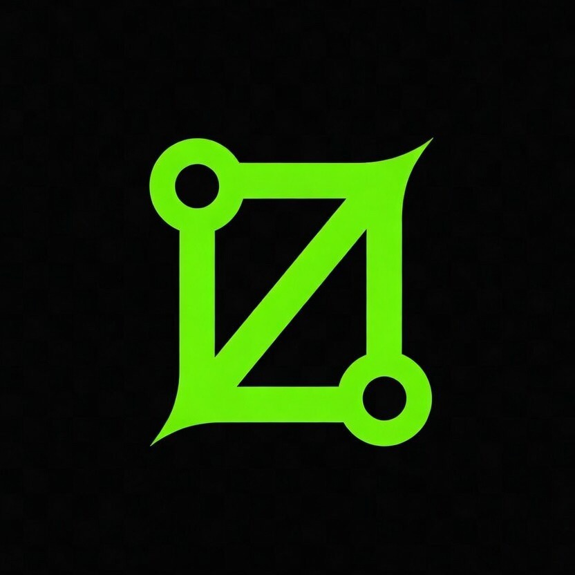

<p align="center">
  <a href="https://theazo.com">
    
  </a>
</p>

<h1 align="center">Theazo Node.js SDK</h1>

<p align="center">
  <strong>Agent infrastructure for developers.</strong>
  <br />
  Run AI agents with per-user isolation, billing, observability, and cost controls.
  <br />
  Use our compute or bring your own — same SDK, same API.
</p>

<p align="center">
  <a href="https://theazo.com/docs"><strong>Docs</strong></a> · <a href="https://theazo.com/pricing"><strong>Pricing</strong></a> · <a href="https://github.com/theazo/theazo-node/issues"><strong>Issues</strong></a>
</p>

<p align="center">
  <a href="https://www.npmjs.com/package/theazo"></a>
  <a href="https://www.npmjs.com/package/theazo"></a>
  <a href="https://github.com/theazo/theazo-node/blob/main/LICENSE"></a>
</p>

---

## Install

```bash
npm install theazo
```

## Quick Start

```typescript
import { Theazo } from 'theazo'

const theazo = new Theazo({ apiKey: process.env.THEAZO_API_KEY })

// Create a session for your end user — isolated compute, billing, limits
const session = await theazo.sessions.forUser('user_123')

// One-liner: create agent, run task, get result
const result = await session.run('researcher', 'analyze competitor pricing')

console.log(result.output)   // "Based on analysis of 12 competitors..."
console.log(result.cost)     // { amount: 3, currency: 'usd' }
console.log(result.duration) // "4.2s"
```

That's it. Theazo created a sandboxed VM, ran Claude with tools, tracked the cost per user, and cleaned up.

---

## Why Theazo

Every AI startup rebuilds the same backend: sandboxed compute, multi-tenant isolation, per-user billing, observability, cost controls. That's 12-16 weeks of infrastructure before writing product code.

Theazo replaces all of it with one SDK.

```
Without Theazo                           With Theazo
─────────────                            ──────────
E2B + Langfuse + Stripe metering         npm install theazo
+ custom isolation layer                 3 lines of code
+ per-user billing pipeline              Ship today
+ cost controls + rate limiting
= 12-16 weeks, $45-75K eng cost          = minutes, $0 upfront
```

---

## What You Get

| Feature | Description |
|---------|-------------|
| **Sessions** | Per-user isolation — User A can't see User B's agents, data, or costs |
| **Agents** | Sandboxed Python/Node/Go compute. Managed or bring your own (E2B, Fly, K8s) |
| **Workflows** | Multi-step pipelines — sequential, parallel, conditional, dynamic DAGs, approval gates |
| **Fleets** | Batch N tasks in parallel with concurrency control and cost caps |
| **Chat** | Multi-turn conversations with streaming, context strategies, and MCP tools |
| **Knowledge** | Upload docs → agents query them automatically (pgvector RAG) |
| **MCP Tools** | Connect external tool servers — agents discover and use tools automatically |
| **Channels** | Chat widget, Slack, email — agents meet users where they are |
| **Scheduling** | Cron schedules + webhook triggers for recurring agent tasks |
| **Approvals** | Human-in-the-loop — pause for approval before sensitive actions |
| **Billing** | Per-user cost tracking, 4-level budget caps, threshold alerts, Stripe export |
| **Observability** | Real-time logs, traces, cost breakdown per agent and per user |
| **BYOI** | Bring your own compute and/or models — same SDK, $0 on Theazo bill |

---

## Bring Your Own Infrastructure (BYOI)

Two independent knobs. Mix and match.

### Bring Your Own Compute

Use your own sandbox provider. Theazo bills $0 for compute — you pay your provider directly.

```
Supported providers:
  E2B           → your E2B API key
  Fly.io        → your Fly token
  Custom / K8s  → any HTTP endpoint (webhook adapter)
```

```bash
# Store key in encrypted vault
curl -X POST https://api.theazo.com/v1/secrets \
  -H "Authorization: Bearer th_live_..." \
  -d '{"e2b_key":"e2b_sk_..."}'

# Configure BYOI compute
curl -X PUT https://api.theazo.com/v1/providers/e2b \
  -H "Authorization: Bearer th_live_..." \
  -d '{"credentialRef":"e2b_key"}'
```

### Bring Your Own Models

Use your own model provider or any AI gateway. Theazo bills $0 for model tokens.

**Direct provider key:**
```bash
curl -X PUT https://api.theazo.com/v1/providers/anthropic \
  -H "Authorization: Bearer th_live_..." \
  -d '{"credentialRef":"anthropic_key"}'
```

**AI gateway** (any OpenAI-compatible endpoint):
```bash
# OpenRouter, LiteLLM, Azure OpenAI, vLLM, Ollama — anything that speaks /v1/chat/completions
curl -X PUT https://api.theazo.com/v1/providers/openai \
  -H "Authorization: Bearer th_live_..." \
  -d '{"credentialRef":"gateway_key","config":{"baseUrl":"https://openrouter.ai/api/v1"}}'
```

### After BYOI Setup

The SDK works exactly the same. Your keys are used automatically.

```typescript
const session = await theazo.sessions.forUser('user_123')
const result = await session.run('researcher', 'analyze market')

console.log(result.cost)
// → { amount: 2, currency: 'usd' }  ← orchestration only, compute + model = $0
```

---

## Workflows

9 step types. Dynamic DAGs. The agent decides what to do next.

```typescript
import { Theazo, workflow } from 'theazo'

// Sequential pipeline
const pipeline = workflow('research-report')
  .step('research', { agent: 'researcher', input: { topic: '$.trigger.topic' } })
  .step('analyze', { agent: 'analyst', input: { data: '$.research.output' } })
  .step('write', { agent: 'writer', input: { analysis: '$.analyze.output' } })
  .build()

// Parallel branches
const parallel = workflow('competitive-analysis')
  .step('research', { agent: 'researcher' })
  .parallel('gather', [
    { id: 'pricing', type: 'agent', agent: 'pricing-analyst' },
    { id: 'features', type: 'agent', agent: 'feature-analyst' },
  ])
  .build()

// Map over array (fan-out/fan-in)
const batch = workflow('classify-tickets')
  .step('fetch', { agent: 'fetcher' })
  .map('classify', {
    over: '$.fetch.output.tickets',
    step: { type: 'agent', agent: 'classifier' },
    concurrency: 10,
  })
  .build()

// With policy + approval gate
const secure = workflow('deploy-pipeline')
  .withPolicy({
    allowTools: ['web_search', 'read_file'],
    maxTotalCost: { amount: 500, currency: 'usd' },
  })
  .step('review', { agent: 'reviewer' })
  .approval('approve', { timeout: '24h' })
  .step('deploy', { agent: 'deployer' })
  .build()
```

**Step types:** `agent` · `parallel` · `condition` · `transform` · `map` · `delay` · `approval` · `webhook` · `planner` (dynamic DAG)

---

## Infra-Only Mode

Already have LangGraph, CrewAI, or custom agent code? Use Theazo as a compute layer.

```typescript
const session = await theazo.sessions.forUser('user_123')
const agent = await session.agents.create({ compute: 'python' })

// Run YOUR code in an isolated sandbox
const result = await agent.exec('python', `
import json
data = {"status": "analyzed", "score": 0.87}
print(json.dumps(data))
`)

console.log(result.stdout)    // {"status": "analyzed", "score": 0.87}
console.log(result.exitCode)  // 0

// Theazo tracked compute time, cost, and isolation — you wrote zero infra code
```

---

## Examples

Every example is self-contained — set `THEAZO_API_KEY` and run.

```bash
cd examples/basic-agent
export THEAZO_API_KEY=th_live_...
npx tsx index.ts
```

| Example | What it shows |
|---------|--------------|
| [basic-agent](./examples/basic-agent) | Create a session, run an agent, get results |
| [streaming](./examples/streaming) | Watch tokens arrive in real-time via SSE |
| [chat](./examples/chat) | Multi-turn conversation with context memory |
| [workflows](./examples/workflows) | Multi-step pipeline — 4 patterns with 9 step types |
| [fleet-dispatch](./examples/fleet-dispatch) | Batch tasks in parallel, stream results |
| [agent-definitions](./examples/agent-definitions) | Save, version, and reuse agent configs |
| [mcp-tools](./examples/mcp-tools) | Connect MCP servers, agents use external tools |
| [approvals](./examples/approvals) | Human-in-the-loop — pause for approval |
| [byoi](./examples/byoi) | Bring your own compute + models |
| [knowledge](./examples/knowledge) | Upload docs, agent uses them as context |
| [scheduling](./examples/scheduling) | Cron schedules + webhook triggers |
| [channels](./examples/channels) | Chat widget for your website |
| [infra-only](./examples/infra-only) | Run your own code in a Theazo sandbox |

---

## Documentation

| Guide | What it covers |
|-------|---------------|
| [Getting Started](https://theazo.com/docs) | Install → first agent in 5 minutes |
| [API Reference](https://theazo.com/docs/api-reference) | Every endpoint — request, response, examples |
| [BYOI Guide](https://theazo.com/docs/byoi) | Bring your own compute, models, or AI gateway |
| [Workflows](https://theazo.com/docs/workflows) | DAG pipelines with 9 step types |
| [Billing](https://theazo.com/docs/billing) | Credits, budgets, per-user metering |
| [MCP Tools](https://theazo.com/docs/mcp) | Connect external tool servers |
| [Channels](https://theazo.com/docs/channels) | Chat widget, Slack, email |

---

## Requirements

- Node.js 18+
- TypeScript 5+ (optional but recommended)

## Contributing

```bash
git clone https://github.com/theazo/theazo-node.git
cd theazo-node
pnpm install
pnpm build
```

## License

[MIT](./LICENSE)
